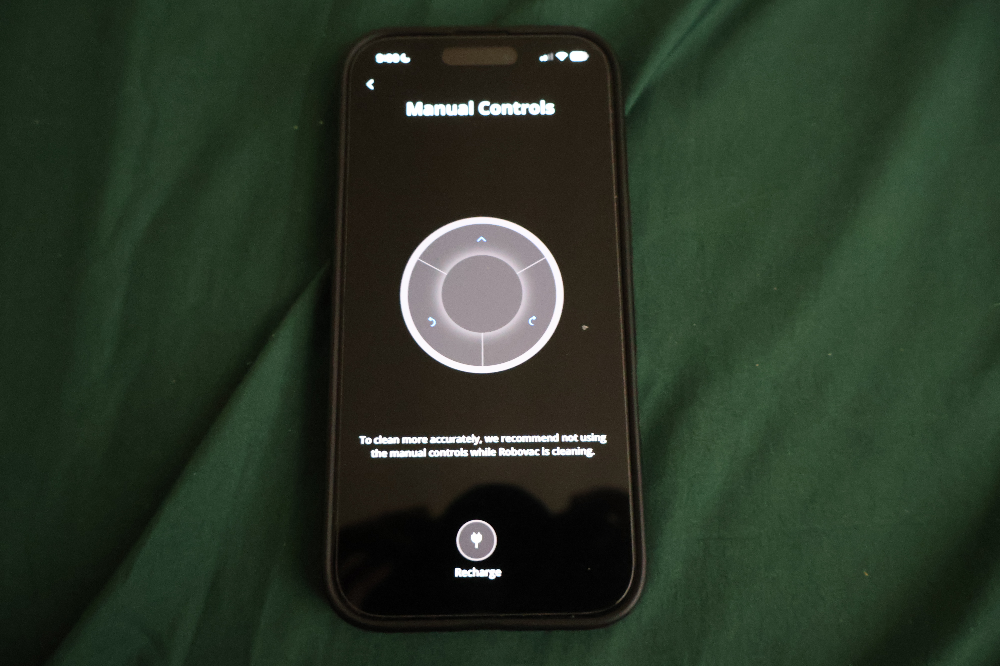

# eufy-controller-bridge

Drive your eufy robot vacuum with a game controller.

**The problem with the app**

The eufy app's manual control gives you three buttons: forward, spin left, spin right. On a touchscreen, you can only press one at a time. To go from moving forward to turning, you have to lift your finger off the forward button first, press the turn button, then go back to forward. Every direction change is a full stop in between.

Your thumb is also guessing. No tactile feedback means you're watching the phone instead of the vacuum, your arm gets tired holding it out, and any slight miss puts your finger in dead space with the vacuum still rolling.

The result: a vacuum you bought to clean autonomously requires your full attention to control manually - the one time you actually need precise control.



**The fix**

This project replaces that with a real game controller. Plug in a PS5 DualSense or 8BitDo, run one command, and drive. Dual analog sticks, proper triggers, tactile bumpers - muscle memory from years of gaming, applied to floor cleaning.

<video src="https://github.com/user-attachments/assets/f1f1de27-be82-4bf9-a046-687b8ccd516b" controls width="100%"></video>

Uses the same MQTT channel as the official app - no rooting, no firmware modification, no local network sniffing required.

---

## How it works

eufy robot vacuums connect to a private AWS IoT Core MQTT broker using mutual
TLS.  This project authenticates with the eufy cloud API to obtain a per-user
X.509 certificate, opens an MQTT session with that certificate, and sends the
same remote-control commands the official phone app sends.

Controllers are read directly via the system HID layer (hidapi).  On startup
the bridge auto-detects whichever supported controller is plugged in.

---

## Compatibility

| Component | Tested |
|---|---|
| Vacuum | eufy RoboVac C20 Omni (model T2280) |
| Controllers | PS5 DualSense (USB-C) · 8BitDo Ultimate 2 (USB, Switch mode) |
| OS | macOS Sequoia 15.x |

Other eufy models that use the same AWS IoT MQTT backend should work.
Open an issue if you test one.

> **DualSense note:** The DualSense must be connected via USB-C.  macOS
> Bluetooth HID exposes a truncated 10-byte report that omits stick data.

> **8BitDo note:** Set the 8BitDo Ultimate 2 to Switch mode (hold S before
> powering on) before connecting via USB.

---

## Prerequisites

- macOS
- Python 3.11 or newer
- [Homebrew](https://brew.sh)
- A eufy account with your vacuum linked in the eufy Home app
- A supported controller (see Compatibility)

---

## Setup

### 1. Install the native HID library

```bash
brew install hidapi
```

### 2. Clone the repo

```bash
git clone https://github.com/YOUR_USERNAME/eufy-controller-bridge.git
cd eufy-controller-bridge
```

### 3. Create a virtual environment and install dependencies

```bash
python3 -m venv .venv
source .venv/bin/activate
pip install -r requirements.txt
```

### 4. Configure your credentials

```bash
cp config.example.py config.py
```

Open `config.py` and fill in:

| Field | Where to find it |
|---|---|
| `EMAIL` | Your eufy account email |
| `PASSWORD` | Your eufy account password |
| `DEVICE_ID` | Printed on the underside of the vacuum (`AOTxxxxxxxxxxxx`). Also: eufy app → tap device → ··· → Device Info → Serial Number |
| `DEVICE_MODEL` | `T2280` for the C20 Omni. Check the eufy app if unsure |

`config.py` is listed in `.gitignore` - it will never be committed.

### 5. Connect your controller via USB

### 6. Take the vacuum off its dock

Press the power button so it beeps and connects to Wi-Fi.

### 7. Run

```bash
python main.py
```

---

## Controls

Controls are normalised across adapters - every controller maps to the same
actions:

| Action | PS5 DualSense | 8BitDo Ultimate 2 |
|---|---|---|
| Drive (stick) | Left stick | Left stick |
| Forward | R2 trigger | ZR trigger |
| Spin left | L1 bumper | L bumper |
| Spin right | R1 bumper | R bumper |
| Return to dock | Touchpad or Options | Plus |
| Quit | PS button | Home button |

The firmware is stateful - it moves continuously while a direction command is
held and stops on BRAKE.  The dominant stick axis determines direction: more
lateral than forward → spin; otherwise → forward/stop.

---

## Adding a new controller

See [`adapters/README.md`](adapters/README.md) for the full adapter contract and a step-by-step guide.

The short version:
1. Create `adapters/yourcontroller.py` implementing `open_controller()` and `parse_report()` returning a `ControllerState`.
2. Add it to `_ADAPTERS` in `adapters/__init__.py`.
3. Run `python tools/read_controller.py` to verify.

---

## Troubleshooting

**"Not authorized" on connect**  
The MQTT client ID must match the pattern `android-eufy_home-*`.  Verify
`DEVICE_ID` and `DEVICE_MODEL` in `config.py`.

**Vacuum enters RC mode but does not move**  
The vacuum must be off its dock with the power button pressed.  RC mode is
rejected when the vacuum is charging.

**Controller not found**  
Run `python -c "import hidapi; [print(d) for d in hidapi.enumerate(0,0)]"` to
list all HID devices and confirm the VID/PID is visible.

**Stick drifts at rest**  
Increase `DEADZONE` in `config.py` (default `0.25`).  Values up to `0.4` are
reasonable.

**Return-to-dock does not work**  
Ensure the dock station is powered and its IR beacon is unobstructed.

---

## Project structure

```
eufy-controller-bridge/
├── main.py               Entry point - connects eufy + controller, handles shutdown
├── controller.py         Generic drive loop - auto-detects controller, talks to eufy
├── config.example.py     Credential template - copy to config.py and fill in values
├── requirements.txt
│
├── eufy/                 Vacuum-side cloud layer  (see eufy/README.md)
│   ├── protocol.py       DPS constants, protobuf encoding, app identity
│   ├── auth.py           Three-step REST login → X.509 certificate + endpoint
│   └── client.py         MQTT session, RC mode lifecycle, drive/dock commands
│
├── adapters/             Controller adapters  (see adapters/README.md)
│   ├── base.py           ControllerState dataclass - the adapter contract
│   ├── ps5.py            Sony DualSense (PS5) - USB-C, macOS byte offsets
│   └── eightbitdo.py     8BitDo Ultimate 2 - Switch mode, 12-bit sticks
│
└── tools/                Debug scripts  (see tools/README.md)
    ├── read_controller.py Print normalised controller state live
    ├── sniff.py          Live MQTT monitor - shows what the eufy app sends
    └── test_drive.py     Pulse FORWARD commands without a controller
```

---

## Debugging tools

### sniff.py

Connects to the same MQTT broker and subscribes to both `/req` and `/res`
topics.  Drive the vacuum with the official app while this runs - every command
and firmware response is printed with the DPS key, value, and raw hex bytes.

This is how we discovered that **DPS 155 (direction) is a plain integer**, not
a protobuf blob.

```bash
python tools/sniff.py
# then drive with the eufy app
```

### test_drive.py

Connects to MQTT and pulses FORWARD commands for 3 seconds without a
controller.  Use this to confirm credentials are correct and the vacuum moves
before debugging the controller side.

```bash
python tools/test_drive.py
```

### read_controller.py

Prints normalised controller state (x, y, trigger, bumpers, quit, dock) in
real time.  No vacuum connection needed.  Use this to verify an adapter is
reading the right bytes before driving anything.

```bash
python tools/read_controller.py
```

---

## Protocol notes (for contributors)

- eufy uses a **private backend** - not the standard Tuya cloud.  Local-key
  extraction via Tuya APIs does not apply here.
- Auth is three REST calls; the third returns a per-user X.509 certificate
  valid for MQTT mutual TLS on `aiot-mqtt-us.anker.com:8883`.
- Commands are JSON envelopes.  `DPS 152` (mode control) uses a
  length-prefixed single-field protobuf, base64-encoded.  `DPS 155`
  (direction) uses a **plain integer** - not a protobuf blob.  This was
  confirmed by sniffing live app traffic.
- `msg_seq` in the envelope must increment on every publish.  The device
  silently deduplicates by sequence number.

---

## Contributing

Pull requests are welcome.  If you test on a different eufy model or add an
adapter for a new controller, please open an issue or PR so compatibility can
be documented.

---

## License

MIT
